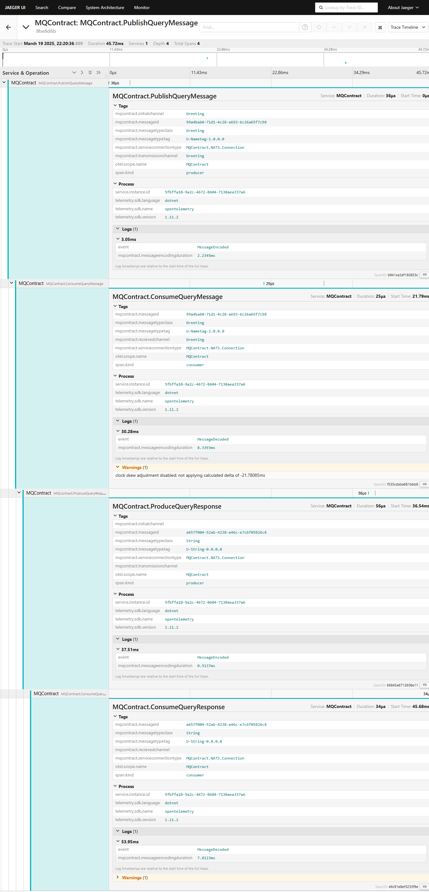

#OpenTelemetry

To enable Open Telemetry support, simply call the EnableOpenTelemetry method:
EnableOpenTelemetry(string activitySource = "MQContract", bool linkActivitiesAcrossSystems = true)
Here you are able specify a custom activitySource is there is a desire, as well as indicate if the activities are to be linked across services.  If this is enabled the system will pass across specific information within the service messages to tie the activities together.  Below is an example screenshot from running a Query Response against a NATS service including linking the activities.

